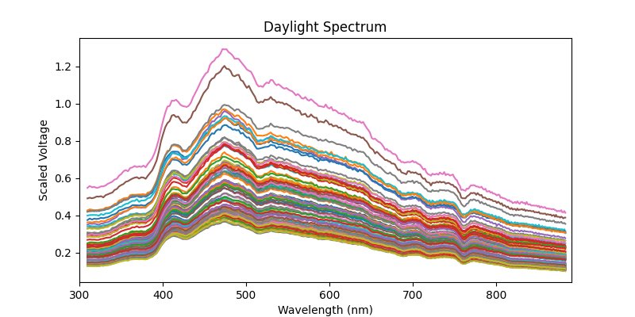

# Spectrometer

An Arduino-based controller for the [Hamamatsu C12880MA](https://www.hamamatsu.com/us/en/product/optical-sensors/spectrometers/mini-spectrometer/C12880MA.html) mini spectrometer using the [ESP32-S3](https://www.espressif.com/en/products/socs/esp32-s3) microcontroller. The figure below shows measurements of daylight entering a window across a 2-hour period just a little after noon in Redwood City California on October 26th, 2024. A simple auto-integration time algorithm was used so the raw voltage readings were scaled by the integration time to show the luminance differences between readings as the sun moved across the sky. (See [examples/spectrum.ipynb](examples/spectrum.ipynb) for the code used to make this plot.)

## Overview

This project includes firmware for controlling the Hamamatsu C12880 mini spectrometer, offering web-based remote control and data acquisition. The system includes temperature and humidity monitoring via an AHT10 sensor. The device is very portable and easily powered for days using a small usb power bank, allowing longitudinal measurements in the field (e.g., to measure the daylight variation in a particular location).

### Features

- Web server interface for spectrometer control
- Over-the-Air (OTA) firmware updates
- WiFi configuration via WiFiManager
- Temperature and humidity data
- Wavelength calibration (be sure to update the coefficients in [getWavelength](firmware/firmware.ino) with the values from your calibration certificate!)
- NTP time synchronization for precise timestamping of measurements
- Status LED indicator

### Integration time

A spectrometer's integration time is the length of time it takes to collect photons and accrue charge on the sensor. It must be adjusted to maximize the signal-to-noise by using the full range of the sensor's analog output while avoiding saturation of any of the pixels. The current firmware does not include an automatic integration time algorithm, so the integration time must be manually set when you call the API to get a reading. The [examples/spectrum.ipynb](examples/spectrum.ipynb) notebook includes an example of how to use the API to automatically select an integration time by making multiple API calls with different integration times to find a value just below the sensor's saturation point.

## Hardware

- **Microcontroller**: ESP32-S3 (e.g., [LOLIN S3 mini](https://www.wemos.cc/en/latest/s3/s3_mini.html))
- **Spectrometer**: [Hamamatsu C12880MA](https://www.hamamatsu.com/us/en/product/optical-sensors/spectrometers/mini-spectrometer/C12880MA.html)
- **Temperature/Humidity Sensor**: AHT10/AHT20 (e.g., [this module](https://www.amazon.com/gp/product/B092495GZJ))
- **Connections**:
  - SPEC_TRG (output): GPIO 12 (requires voltage divider)
  - SPEC_ST (input): GPIO 13 (direct connection)
  - SPEC_CLK (input): GPIO 16 (direct connection)
  - SPEC_EOS (output): GPIO 11 (requires voltage divider)
  - SPEC_VIDEO (output): GPIO 10 (requires voltage divider; see note below)
  - I2C: SDA (GPIO 35), SCL (GPIO 36) (direct connection to the AHT10)

  You can buy a C12880 module and breakout board from [GroupGets](https://groupgets.com/products/hamamatsu-c12880ma-breakout-board). Their board offers level shifters and a buffer for the analog output of the spectrometer. However, the C12880 inputs can be driven directly from the microcontroller as they are rated for a 3V HIGH threshold. You do need to level-shift the digital outputs from the C12880 to avoid damaging the microcontroller. However, this can be easily achived with a simple 2-resistor [voltage divider]](https://randomnerdtutorials.com/how-to-level-shift-5v-to-3-3v/) (I used a 5K/10K pair). The S3 analog input is high impedance and does not need a buffer (but *does* need a divider; see notes below). Given this, I picked up a C12880 (with calibration certificate) from ebay for under $200 and built a simple breakout board with spare parts. (A schematic and pcd files for the breakout are coming soon!)

### Analog notes
The ESP32 had [notoriously bad](https://www.reddit.com/r/esp32/comments/1dgjxtm/honest_question_why_is_the_adc_so_bad_non_rant/) ADC performance, but the ESP32-S3 has a much improved ADC. I did some preliminary tests using an external [12-bit SPI ADC](https://www.microchip.com/en-us/product/mcp3204), an [op-amp buffer](https://www.ti.com/lit/ds/symlink/opa344.pdf?ts=1731079872575), and a simple voltage divider to read the C12880 analog output but the results were actually *more* noisy than using the S3's ADC with no buffer and just a 2-resistor divider. Take this external ADC test with a grain of salt, as this was done on a breadboard, so it's quite possible that a well-designed PCB could yield better results with an external ADC. But for my purposes, the simplest solution was good enough to achieve very stable spectrometer readings. Also note that unlike the divider for the digital pins, I paid careful attention to the exact resistance values to achive a full-range ADC input of [0-3.1V](https://docs.espressif.com/projects/esp-idf/en/v4.4.3/esp32s3/api-reference/peripherals/adc.html) and measured a bunch of individual resistors to pick a pair that got me closest to <= 3.1V (e.g., a 2K that measures a bit high and a 3.3K that measures a bit low). Adding a small (0.1nF) filter capacitor helped with stability.

## Firmware

To achieve fast calibrated millivolt ADC reads, I used the [ESP32-S3-FastAnalogRead](https://github.com/stg/ESP32-S3-FastAnalogRead) library (code is included in this repo for convenience). Note that this library is not yet updated for ESP-Arduino 3.x. If you get compile errors related to adc functions, try downgrading to ESP-Arduino 2.x. Or better yet, update the code and do a pull request!

Note that the C12880 wavelenths are individually calibrated and thus you should receive a calibration certificate with your spectrometer. You must update the coefficients in [getWavelength](firmware/firmware.ino) with the values from your calibration certificate to get accurate data.

The web API returns json payloads. To keep things simple and fast, I used snprintf to build the JSON payload strings. This works well for now, but will not be the easiest to maintain if the API is expanded. In that case, this code should be refactored to use a proper JSON library like [ArduinoJson](https://arduinojson.org/).

The firmware code uses the following Arduino libraries:
- [Streaming](https://github.com/janelia-arduino/Streaming)
- [AHTxx](https://github.com/m5stack/AHTxx)
- [ESP32-S3-FastAnalogRead](https://github.com/stg/ESP32-S3-FastAnalogRead) (included in this repo)
- Custom C12880 library (included in this repo)

## Software

See the [Jupyter](https://jupyter.org/) notebook in [examples](examples) for a simple example of how to read spectrum data from the spectrometer using python code.

## Installation

1. Install the Arduino IDE
2. Add ESP32 board support to Arduino IDE
3. Install required libraries through the Arduino Library Manager
4. Select "LOLIN S3 mini" as the board
5. Enable "USB CDC On Boot" in Tools menu
6. Upload the firmware

## Configuration

The device uses WiFiManager for initial WiFi setup:
1. On first boot, the device creates an access point
2. Connect to the AP and configure your WiFi credentials
3. The device will automatically connect to your network on subsequent boots

## Usage

The device provides a web interface accessible via its IP address. Available endpoints:
- `/wavelength`: Get the calibrated wavelengths.
- `/spectrum/{integration_time}`: Acquire spectral data for a given integration time. (see python code for more details)
- `/temperature`: Get the temperature and humidity.
- `/i2c`: Scan I2C bus for connected devices (useful for debugging I2C issues)

## Development

### TODO

- Improve performance by removing delayMicros in clock logic. The C12880 supports being clocked at up to 5MHz, but we are maxing out at less than 0.5MHz due to the use of delayMicros, which has a theoretical minimum delay of 1us, but in practice is about 1.5us. Options for removing this limit include:
  - use a peripheral that can generate the pulses, like the [RMT](http://esp32.io/viewtopic.php?t=37725)
  - [dedicated GPIO](https://docs.espressif.com/projects/esp-idf/en/latest/esp32s3/api-reference/peripherals/dedic_gpio.html)
  - [GPTimer](https://docs.espressif.com/projects/esp-idf/en/latest/esp32/api-reference/peripherals/gptimer.html); [Arduino API](https://docs.espressif.com/projects/arduino-esp32/en/latest/api/timer.html)
  
  Of these, the first is likely to be the most performant and should be able to easily hit 5MHz with minimal CPU cycles. But the GPTimer approach is probably the easilest to implement.
- Add an API endpoint to set and store calibration coefficients
- Add an automatic integration time selection algorithm
- Add a web GUI
- Design a better enclosure

### Info
- Version: 0.3
- Author: Bob Dougherty
- Repository: https://github.com/rfdougherty

## License

MIT License
